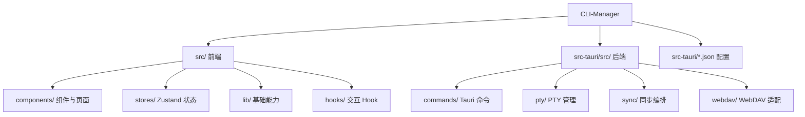

# CLI-Manager

> 生成时间：2026-04-21T11:06:35+08:00

## 概述

CLI-Manager 是一款基于 Tauri 2 的 Windows 桌面应用，用于集中管理多个开发项目的 CLI 终端（支持 PowerShell / CMD / PWsh / WSL / Bash）。

前端负责项目管理、终端交互、历史会话、统计看板与设置；Rust 后端负责 PTY 会话管理、系统能力、历史解析、同步与 WebDAV 适配。

## 技术栈

- **语言**：TypeScript、Rust
- **框架**：React 19、Tauri 2.x
- **构建**：Vite 7、Cargo
- **终端**：xterm.js + FitAddon + WebglAddon
- **状态管理**：Zustand
- **数据存储**：SQLite（`tauri-plugin-sql`）+ Store（`tauri-plugin-store`）
- **样式**：Tailwind CSS 4
- **包管理**：npm

## 项目结构



## 模块索引

| 模块 | 路径 | 职责 |
|------|------|------|
| 前端入口 | `src/main.tsx`、`src/App.tsx` | React 挂载、应用初始化、整体布局与全局面板装配 |
| 前端组件层 | `src/components/` | 侧边栏、终端标签/分屏、命令面板、历史工作区、统计面板、设置页 |
| 历史与统计 UI | `src/components/history/`、`src/components/stats/` | 历史会话浏览、Diff 展示、检索结果、统计图表与下钻交互 |
| 提示词与设置 UI | `src/components/prompts/`、`src/components/settings/` | Prompt Library、多页设置中心与导航 |
| 状态管理层 | `src/stores/` | 管理 settings、projects、terminal、session、history、sync、template、commandHistory |
| 基础能力层 | `src/lib/` | SQLite 访问、共享类型、日志、外部终端桥接、Shell/主题工具 |
| 交互 Hook | `src/hooks/` | 键盘快捷键、焦点控制等交互逻辑 |
| Tauri 装配入口 | `src-tauri/src/lib.rs` | 注册插件、SQLite migrations、状态对象与 invoke handler |
| Rust 命令层 | `src-tauri/src/commands/` | 暴露 PTY、文件校验、外部终端、历史、同步、版本、日志相关命令 |
| PTY 核心 | `src-tauri/src/pty/` | 终端会话生命周期、读写、resize、状态广播 |
| 同步层 | `src-tauri/src/sync/` | 同步数据模型、冲突处理、上传/下载编排 |
| WebDAV 适配层 | `src-tauri/src/webdav/` | 远端存储访问与认证能力 |
| Tauri 配置 | `src-tauri/tauri.conf.json`、`src-tauri/capabilities/default.json` | 窗口、构建、bundle 与 capability 配置 |

## 入口文件

- `src/main.tsx` - React 入口，初始化日志并挂载 `App`
- `src/App.tsx` - 前端应用壳，依次加载设置、同步配置、会话持久化、项目列表并恢复终端会话
- `src-tauri/src/main.rs` - Tauri 二进制入口，调用 `cli_manager_lib::run()`
- `src-tauri/src/lib.rs` - Tauri 主装配入口，注册插件、迁移、状态与命令
- `src-tauri/tauri.conf.json` - 前端构建命令、窗口配置与打包入口

## IPC 命令摘要

前端通过 `invoke(...)` 调用后端命令：

- **终端**：`pty_create`、`pty_write`、`pty_resize`、`pty_close`、`pty_status`
- **文件/系统**：`check_paths_exist`、`open_windows_terminal`、`set_debug_logging`、`get_app_version`
- **历史会话**：`history_list_sessions`、`history_get_session`、`history_search`、`history_list_prompts`、`history_get_stats`
- **同步**：`sync_test_connection`、`sync_upload`、`sync_download`

后端通过 `app_handle.emit("pty-output-{sessionId}", data)` 向前端推送 PTY 输出。

## 数据层

- SQLite 表：`projects`、`command_templates`、`groups`、`command_history`、`session_meta`、`sync_meta`
- migrations 定义在 `src-tauri/src/lib.rs`，当前为 **v1-v7**
- 前端通过 `Database.load("sqlite:cli-manager.db")` 直接访问 SQLite
- 用户偏好通过 `tauri-plugin-store` 持久化

## 最近变更（沿用现有记录，截止 2026-03-25）

- 分析看板 S1（C1/C2/C3）：新增会话/消息趋势图与 Token 构成图，支持 hover 详情与日期下钻联动。
- 分析看板 S2（C4/C5）：项目活跃排行升级为可交互横向柱图（点击即按项目过滤），模型占比升级为构成图（前 5 + 其他）。
- 分析看板 S3（C6）：热力图统一图表交互（hover/selected 反馈、键盘方向键移动焦点、Enter/Space 下钻、a11y 标签）。
- 分析看板 S4（V2，C7~C10）：`history_get_stats` 扩展 `daily_series/source_distribution/project_efficiency/hourly_activity`，前端新增 Token 趋势、来源对比、效率散点、时段分布图。
- 历史会话列表增强：新增时间分组（Today/Yesterday/This Week/This Month/Earlier）、来源筛选与历史侧栏宽度记忆。
- 历史会话交互优化：修复左右拖拽卡顿，拖动过程使用帧节流更新，松手后再持久化设置；并修复拖拽宽度计算错误导致的“无法拖动”问题。
- 历史会话筛选调整：移除“分支筛选”（历史日志中的分支字段存在 `HEAD` 等不稳定值，易误导）。
- Diff 视图增强：支持 Unified Diff 与 Codex `*** Begin Patch` 风格；支持从 diff 块跳回触发消息；新增行级高亮（新增/删除/hunk/header）。
- Diff 滚动体验修复：代码块保留独立横向滚动容器与可见滚动条样式，避免整页横向空白拖动。
- 后端历史解析增强：放宽 Codex tool-call patch 提取（`custom_tool_call`、`file-history-snapshot`）以提高 diff 命中率。
- 模板作用域增强：命令模板支持全局/项目/会话（会话级模板仅在当前会话有效，随会话生命周期清理）。
- 分析看板（Phase P2）：新增 `history_get_stats`，汇总会话数、消息数、输入/输出 Token，输出项目排行、模型占比与热力图。
- 分析看板 UI：新增 `StatsPanel` + `TimelineHeatmap`，支持项目筛选、7/30/90 天范围、点击日期展开当日会话并跳转。
- 入口调整：看板入口从历史会话详情区迁移到侧边栏底部“设置”按钮左侧，弹层改为 `App` 全局挂载。
- 说明：本次摘要按要求不包含 `P1-1 Prompt Library（三级作用域）` 作为验收项。

## 快速命令

```bash
npm install
npm run tauri dev
npm run tauri build
npx tsc --noEmit
cd src-tauri && cargo check
cd src-tauri && cargo test
```

<!-- gitnexus:start -->
# GitNexus — Code Intelligence

This project is indexed by GitNexus as **CLI-Manager** (2320 symbols, 3777 relationships, 133 execution flows). Use the GitNexus MCP tools to understand code, assess impact, and navigate safely.

> If any GitNexus tool warns the index is stale, run `npx gitnexus analyze` in terminal first.

## Always Do

- **MUST run impact analysis before editing any symbol.** Before modifying a function, class, or method, run `gitnexus_impact({target: "symbolName", direction: "upstream"})` and report the blast radius (direct callers, affected processes, risk level) to the user.
- **MUST run `gitnexus_detect_changes()` before committing** to verify your changes only affect expected symbols and execution flows.
- **MUST warn the user** if impact analysis returns HIGH or CRITICAL risk before proceeding with edits.
- When exploring unfamiliar code, use `gitnexus_query({query: "concept"})` to find execution flows instead of grepping. It returns process-grouped results ranked by relevance.
- When you need full context on a specific symbol — callers, callees, which execution flows it participates in — use `gitnexus_context({name: "symbolName"})`.

## Never Do

- NEVER edit a function, class, or method without first running `gitnexus_impact` on it.
- NEVER ignore HIGH or CRITICAL risk warnings from impact analysis.
- NEVER rename symbols with find-and-replace — use `gitnexus_rename` which understands the call graph.
- NEVER commit changes without running `gitnexus_detect_changes()` to check affected scope.

## Resources

| Resource | Use for |
|----------|---------|
| `gitnexus://repo/CLI-Manager/context` | Codebase overview, check index freshness |
| `gitnexus://repo/CLI-Manager/clusters` | All functional areas |
| `gitnexus://repo/CLI-Manager/processes` | All execution flows |
| `gitnexus://repo/CLI-Manager/process/{name}` | Step-by-step execution trace |

## CLI

| Task | Read this skill file |
|------|---------------------|
| Understand architecture / "How does X work?" | `.claude/skills/gitnexus/gitnexus-exploring/SKILL.md` |
| Blast radius / "What breaks if I change X?" | `.claude/skills/gitnexus/gitnexus-impact-analysis/SKILL.md` |
| Trace bugs / "Why is X failing?" | `.claude/skills/gitnexus/gitnexus-debugging/SKILL.md` |
| Rename / extract / split / refactor | `.claude/skills/gitnexus/gitnexus-refactoring/SKILL.md` |
| Tools, resources, schema reference | `.claude/skills/gitnexus/gitnexus-guide/SKILL.md` |
| Index, status, clean, wiki CLI commands | `.claude/skills/gitnexus/gitnexus-cli/SKILL.md` |

<!-- gitnexus:end -->
