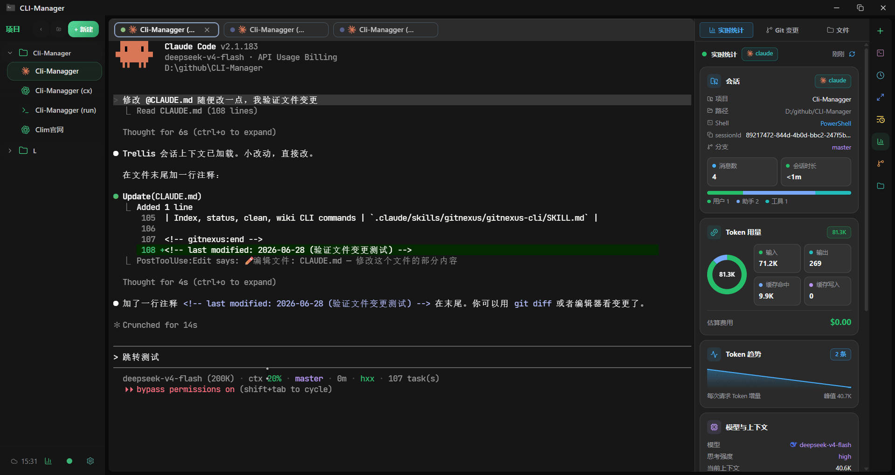

# CLI-Manager

> **Language**: [简体中文](README.md) | English

<div align="center">

**🚀 Cross-platform AI CLI workspace**

[](https://tauri.app/)
[](https://react.dev/)
[](https://www.rust-lang.org/)
[](https://typescriptlang.org/)
[](https://github.com/dark-hxx/CLI-Manager)
[](LICENSE)

A multi-project terminal manager deeply optimized for **Claude Code / Codex CLI**

[Features](#-core-features) • [Preview](#-preview) • [Quick Start](#-quick-start) • [Tech Stack](#-tech-stack) • [Community](#-community)

</div>

---

## 💡 Overview

CLI-Manager is a desktop app focused on **AI CLI workflow enhancement**. It combines multi-project terminal management with deep Claude Code / Codex CLI integration.

> **Platform support**: Windows (fully tested) | macOS / Linux (experimental, feedback welcome)

### 🎯 Why CLI-Manager?

When developing across multiple projects, you may run into these problems:

- ❌ You must keep watching the terminal while Claude / Codex runs, and one missed approval request can block the task
- ❌ You want to review what code changed in a previous session, but Claude history has no Diff view
- ❌ You do not know how many tokens you used this month or which project costs the most
- ❌ You switch terminals across many projects and repeatedly type the same commands
- ❌ You want different Claude backends for different projects (official / proxy / self-hosted), but have to edit environment variables manually

**CLI-Manager provides:**

✅ **Real-time hook notifications** - desktop alerts when Claude needs approval, click to jump back<br>
✅ **Live session statistics** - token usage, cost, and tool calls for each terminal session<br>
✅ **Historical Diff review** - review code changes across sessions and jump back to the triggering message<br>
✅ **Usage analytics dashboard** - heatmaps, trends, efficiency scatter charts, and more<br>
✅ **Project-level provider switching** - switch Claude backend per project without editing config manually<br>
✅ **Flexible split layout** - free terminal splits plus tab dragging across panes<br>
✅ **Command palette and templates** - launch projects or run common commands quickly with `Ctrl+P`

---

## ✨ Core Features

### 🔥 Deep Claude Code / Codex CLI Integration

<table>
<tr>
<td width="50%">

#### 🔔 Real-time Hook Notifications

- **Approval reminders** - desktop notification when Claude needs approval, click to jump back
- **Task status sync** - terminal tabs show running / waiting approval / completed / failed states in real time
- **OSC 133 shell integration** - standardized command boundary detection
- **SessionStart binding** - automatically links a terminal with its Claude session ID

</td>
<td width="50%">

#### 📊 Live Session Statistics

- **Real-time token monitoring** - input / output / cache token composition for the current session
- **Cost estimation** - real-time cost estimate for the current session
- **Tool call details** - see which tools / MCP extensions Claude invoked
- **Git branch display** - automatically detects the current project's Git branch

</td>
</tr>
</table>

<table>
<tr>
<td width="50%" align="center">

<br><sub>Hook notification popup + live tab status sync</sub>
</td>
<td width="50%" align="center">

<br><sub>Live terminal statistics: tokens / cost / Git branch</sub>
</td>
</tr>
</table>

---

### 📜 Unified Session History

<table>
<tr>
<td width="50%">

#### 🗂️ Session Browsing

- **Unified view** - browse Claude Code / Codex history in one place
- **Smart filters** - group and filter by source / project / time
- **In-session search** - highlighted search results with jump navigation
- **Tags and favorites** - mark important sessions for later

</td>
<td width="50%">

#### 🔍 Diff Review

- **Code change visualization** - supports Unified Diff and Codex Patch style
- **Line-level highlighting** - added / removed / hunk header lines use distinct colors
- **Jump to triggering message** - navigate from a Diff block back to the related conversation
- **Prompt Library** - extract historical prompts for quick reuse

</td>
</tr>
</table>

<p align="center">

<br><sub>Session history list + in-session search and Diff review</sub>
</p>

---

### 📈 Multi-dimensional Usage Analytics

#### Data Insights

- **Token composition analysis** - input / output / cache creation / cache read breakdown
- **Cost estimation** - automatic pricing for Claude, GPT, and o-series models
- **Project ranking** - click a project name to filter by project
- **Activity heatmap** - 7 / 30 / 90 day ranges, click a date to inspect sessions from that day
- **Token trend chart** - session / message / token trends with hover details
- **Efficiency scatter chart** - project efficiency analysis (token usage vs session count)
- **24-hour activity distribution** - understand your most active hours

<table>
<tr>
<td width="50%" align="center">

<br><sub>Analytics dashboard: heatmap / token trend / efficiency scatter / project ranking</sub>
</td>
<td width="50%" align="center">

<br><sub>Token composition pie chart / model share / active hour distribution</sub>
</td>
</tr>
</table>

---

### 🔄 cc-switch Provider Integration

#### Project-level Backend Switching

- **Provider management** - read-only parsing of the cc-switch database, grouped by `app_type`
- **Project-level switching** - right-click project -> switch provider -> automatically writes `.claude/settings.json`
- **Global default / project override** - choose either global default or project-level override
- **Provider badges** - projects with overridden providers display dedicated badges in the project tree

**Use cases:**

- Use the official API for project A
- Use a proxy backend for project B
- Use a self-hosted backend for project C
- Switch with one click instead of editing environment variables manually

<table>
<tr>
<td width="50%" align="center">

<br><sub>Provider list and details</sub>
</td>
<td width="50%" align="center">

<br><sub>Project context menu: switch provider with one click</sub>
</td>
</tr>
</table>

---

### 💻 Terminal and Splits

<table>
<tr>
<td width="50%">

#### 🖥️ Built-in Terminal

- **Multiple shell support** - Windows (PowerShell / CMD / Pwsh / WSL / Git Bash), macOS / Linux (Bash / Zsh, etc.)
- **Tab management** - drag sorting / overflow scrolling / duplicate configuration
- **Performance optimizations** - high-frequency output batching / WebGL rendering / lower refresh rate for inactive terminals
- **Chinese IME support** - stable candidate window anchoring and stream redraw resilience
- **Terminal search** - search terminal output with `Ctrl+F`
- **Custom background** - image / opacity / blur / dark overlay

</td>
<td width="50%">

#### 📐 Flexible Splits

- **Free layout** - Split Right / Split Down / mixed nested splits
- **Draggable separators** - adjust adjacent pane ratios
- **Drag tabs across panes** - move tabs to another pane or create a split at the edge
- **Independent tab bars** - each pane has its own tab bar

</td>
</tr>
</table>

<p align="center">

<br><sub>Flexible split layout + dragging tabs across panes</sub>
</p>

---

### ⚡ Command Reuse and Shortcuts

#### 🎯 Command Palette

- **Global `Ctrl+P` palette** - fuzzy search and keyboard navigation
- **Quick project launch** - start a project terminal directly from the palette
- **Run command templates** - execute common commands with one click

#### 📝 Command Templates

- **Three scopes** - global / project / session-level templates
- **Variable substitution** - `${projectPath}` / `${projectName}`
- **Command history** - automatically records commands, with search and replay

<table>
<tr>
<td width="50%" align="center">

<br><sub>Command palette: fuzzy search + quick launch</sub>
</td>
<td width="50%" align="center">

<br><sub>Command templates: three scopes + variable substitution</sub>
</td>
</tr>
</table>

---

### 🗂️ Project Management

- **Project groups** - nested groups / drag sorting / collapse and expand
- **Project config** - dedicated path / shell / startup command / environment variables
- **Health checks** - automatically detects invalid paths
- **Context menu** - open directory / switch provider / launch terminal
- **Git integration** - automatically detects project Git branch

---

### ☁️ WebDAV Cloud Sync

- **Multi-device sync** - saves independent snapshots by device name
- **Custom remote directory** - supports nested paths such as `backups/cli-mgr`
- **Conflict detection** - local first / remote first / manual merge
- **Local import and export** - zip backup support

---

### 🎨 Personalization and Themes

- **App themes** - multiple built-in themes and customization
- **Terminal themes** - Tokyo Night / Dracula / Monokai / Nord / Solarized, etc.
- **Font customization** - UI font / terminal font / size / font color
- **Shortcut configuration** - all shortcuts are customizable
- **Compact mode** - compact UI plus external terminal by default

---

## 🧪 Beta Features

The following features are still being refined. Feedback is welcome.

### 🤖 Automatic Sub-agent Splitting (cmux-like)

- **Smart splits** - automatically creates split terminals when Claude Code dispatches sub-agents
- **Session association** - each sub-agent gets an independent terminal with live status sync
- **Layout optimization** - automatically adjusts split layout based on agent count

> 💡 This feature is in Beta. If you run into issues, please submit an [Issue](https://github.com/dark-hxx/CLI-Manager/issues).

---

## 📸 Preview

<p align="center">

<br><sub>Main interface - terminal workspace</sub>
</p>

---

## 🛠️ Tech Stack

### Frontend

- **Framework**: React 19 + TypeScript 5.8
- **Build tool**: Vite 7
- **State management**: Zustand
- **Styling**: Tailwind CSS 4
- **Terminal**: xterm.js + FitAddon + WebglAddon
- **UI components**: Radix UI, Mantine Core
- **Charts**: ECharts
- **Drag and drop**: @dnd-kit
- **Diff rendering**: react-diff-view

### Backend

- **Runtime**: Tauri 2.x
- **Language**: Rust
- **Database**: SQLite (tauri-plugin-sql)
- **Storage**: tauri-plugin-store
- **PTY**: Rust PTY session management
- **Cloud sync**: WebDAV adapter layer

### Core Capabilities

- Cross-platform desktop app (Windows / macOS / Linux, based on Tauri 2)
- Multi-shell support (Windows: PowerShell / CMD / Pwsh / WSL / Git Bash; macOS / Linux: Bash / Zsh, etc.)
- PTY session management and status broadcasting
- Claude Code / Codex Hook Bridge (127.0.0.1 loopback + bearer token validation)
- Automatic sub-agent splitting (cmux-like, creates split terminals when Claude Code dispatches sub-agents)
- History parsing (Claude / Codex sessions and Diffs)
- Read-only cc-switch provider database parsing
- WebDAV cloud sync and conflict handling
- Git integration (branch detection / project path health checks)

---

## 🚀 Quick Start

### Option 1: Download a Release

Go to the [Releases](https://github.com/dark-hxx/CLI-Manager/releases) page and download the latest version.

> Windows builds are the primary release artifact at the moment. macOS / Linux users are recommended to build from source.

### Option 2: Run from Source

#### Prerequisites

- Node.js >= 18
- Rust >= 1.70
- Operating system: Windows 10/11 | macOS | Linux

#### Install Dependencies

```bash
npm install
```

#### Start Development Mode

```bash
npm run tauri dev
```

#### Build a Release

```bash
npm run tauri build
```

#### Other Useful Commands

```bash
# TypeScript type check
npx tsc --noEmit

# Rust check
cd src-tauri && cargo check

# Rust tests
cd src-tauri && cargo test
```

---

## 🎯 Use Cases

- ✅ Developers who use Claude Code / Codex CLI heavily
- ✅ Users who need real-time token usage and cost monitoring
- ✅ Users who want to review historical session code changes
- ✅ Multi-project development workflows with frequent terminal switching
- ✅ Users who manage multiple Claude backends with cc-switch
- ✅ Users who need to sync development configuration across devices

---

## 📋 Feature Quick Reference

<details>
<summary><b>Project Management</b></summary>

- Project groups / search / drag sorting
- Project configuration (path / shell / startup command / environment variables)
- Path health checks
- Automatic Git branch detection
- Context menu (open directory / switch provider)

</details>

<details>
<summary><b>Terminal Workspace</b></summary>

- Built-in PTY terminal (xterm.js)
- Tab management (drag sorting / overflow scrolling / duplicate configuration)
- Flexible splits (Split Right / Split Down / mixed nested splits)
- Drag tabs across panes
- Terminal search (`Ctrl+F`)
- Custom background (image / opacity / blur)
- Chinese IME support

</details>

<details>
<summary><b>Claude / Codex Integration</b></summary>

- Real-time hook notifications (approval / completed / failed)
- Tab status dots (running / waiting approval / completed / failed)
- Live session statistics (tokens / cost / tool calls / Git branch)
- Unified session history
- Diff review (Unified Diff / Codex Patch)
- In-session search / tags / favorites
- Prompt Library

</details>

<details>
<summary><b>Usage Analytics</b></summary>

- Multi-dimensional analytics dashboard
- Token composition analysis (input / output / cache)
- Cost estimation
- Interactive project ranking
- Activity heatmap (7 / 30 / 90 days)
- Token trend chart
- Efficiency scatter chart
- 24-hour activity distribution

</details>

<details>
<summary><b>cc-switch Integration</b></summary>

- Read-only provider database parsing
- Grouped by `app_type`
- Project-level provider switching
- Automatically writes `.claude/settings.json`
- Global default / project override

</details>

<details>
<summary><b>Command Reuse</b></summary>

- Command palette (`Ctrl+P`)
- Command templates (global / project / session-level)
- Command history (automatic recording / search / replay)
- Variable substitution (`${projectPath}` / `${projectName}`)

</details>

<details>
<summary><b>Cloud Sync</b></summary>

- WebDAV multi-device sync
- Custom remote directory
- Conflict detection (local first / remote first)
- Local import and export (zip)

</details>

<details>
<summary><b>Personalization</b></summary>

- App themes / terminal themes
- Font customization (UI / terminal / size / color)
- Shortcut configuration
- Compact mode
- Custom terminal background

</details>

---

## 🔑 Default Shortcuts

| Shortcut | Action |
|---|---|
| `Ctrl+P` | Open command palette |
| `Ctrl+K` | Open session history |
| `Ctrl+Shift+T` | New terminal |
| `Ctrl+W` | Close current terminal |
| `Alt+ArrowRight` | Next tab |
| `Alt+ArrowLeft` | Previous tab |
| `F11` | Terminal fullscreen |
| `Ctrl+F` | Terminal search / in-session search |

> 💡 All shortcuts can be customized in Settings - Shortcuts.

---

## 💬 Community

<p align="center">
  
  <br>
  <sub>Scan the QR code to join the WeChat community for updates and support</sub>
</p>

---

## 🎉 Acknowledgements

This project was promoted in the [LINUX DO](https://linux.do/) community. Thanks to the LINUX DO community for supporting and recognizing open-source projects.

---

## 📄 License

CLI-Manager is dual-licensed:

- **Open source**: [AGPL-3.0-or-later](LICENSE). Companies and individuals may use, study, modify, distribute, and provide network access to CLI-Manager under the AGPL terms.
- **Commercial**: Proprietary integration, closed-source modifications, internal productization where AGPL obligations are not acceptable, commercial redistribution, or hosted/managed offerings under proprietary terms require a separate commercial license. See [COMMERCIAL-LICENSE.md](COMMERCIAL-LICENSE.md).

Copyright (c) 2026 Chenyme. See [NOTICE](NOTICE).

Ordinary use of the unmodified application does not require a commercial license. Open-source use that complies with AGPL-3.0-or-later does not require a commercial license.

---

<div align="center">

**⭐ If this project helps you, a Star is appreciated.**

[Submit Issue](https://github.com/dark-hxx/CLI-Manager/issues) • [Contribute](https://github.com/dark-hxx/CLI-Manager/pulls) • [View Docs](docs/功能清单.md)

</div>
